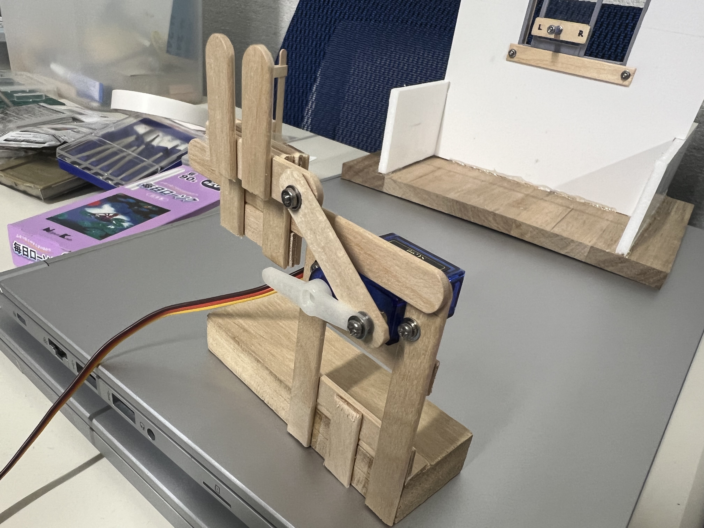

# WindoWServoシステム
- 当システムは近年多発するゲリラ豪雨を雨センサーで感知し、自動で窓を閉めて室内を保護します。
- また合わせて音声によるハンズフリー操作を搭載し、手が離せない状況でも窓の開放をコントロールします。 
**ESP32**による雨感知とモーター制御による自動窓閉鎖機能。 
**RaspberryPi**に搭載したローカルAIによる音声認識とLLM-API(ChatGPT5mini-Chat Completions API)を組み合わせた、ファジーな命令でも動作する開放機能が特徴です。

---

## 使用技術

| 技術スタック | 詳細 |
| :--- | :--- |
| **ハードウェア** | **RaspberryPi4** [**ESP32-CherryIoT**](images/ESP32.jpg) * 2 (学習教材として[**こちら**](https://github.com/DenkiJoshi/ESP32CherryIoT)の機器をお借りして使用しています。) **USB Mic**(市販マイク) **Crowtail Water Sensor 2.0**(抵抗値計測型水センサー) **MicroServoSG90**(サーボモーター) **Crowtail Button 2.0**(ボタンスイッチ)|
| **使用言語** | **Python3** **Aruduino C++** |
| **使用AI・ローカルモデル** | **Vosk** |
| **使用AI・開発支援** (コード生成支援) | **Claude Sonnet4** **Gemini 2.5** **Chat-GPT5** |
| **使用AI・API** | **OpenAI-API**(GPT5-mini, Chat Completions API) |

---

##  実機画像

<table>
  <tr>
    <td align="center">
      <figure>
        <figcaption align="center">
          <code>動力部前面</code>
        </figcaption>
        
      </figure>
    </td>
    <td align="center">
      <figure>
        <figcaption align="center">
          <code>動力部背面</code>
        </figcaption>
        
      </figure>
    </td>
  </tr>
</table>
